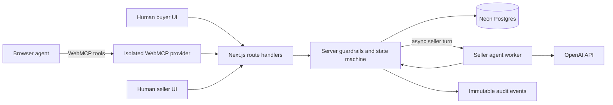

# Haggle

**Local deals, handled together.** Haggle is an agent-native second-hand bicycle marketplace built for the WebMCP Challenge. A buyer's browser agent can search listings, set a spending guardrail, and negotiate structured terms with a resident seller agent. The humans on both sides still approve the final deal.

**Live demo:** [haggle-web-mcp.vercel.app](https://haggle-web-mcp.vercel.app)

Haggle treats local commerce as more than a checkout button: price, pickup or delivery, public meeting place, time window, and included accessories are all first-class negotiable terms.

## Why WebMCP matters here

A normal marketplace page can be read by an agent. Haggle makes the marketplace *operable* by an agent through a small, state-aware tool surface:

- Base tools are always available: `search_listings`, `get_listing`, `get_my_negotiations`, and `set_budget`.
- Contextual tools are registered only when valid: `make_offer`, `counter_offer`, `accept_deal`, and `reject_deal`.
- The surface changes as a negotiation advances. After a seller counters, for example, `make_offer` disappears and the valid response tools appear.
- Tool availability is guidance, not authorization. Every mutation is revalidated by the server.
- Human approval is intentionally not exposed as a WebMCP tool.

All experimental WebMCP usage is isolated in [`src/components/webmcp/webmcp-provider.tsx`](src/components/webmcp/webmcp-provider.tsx). It feature-detects `document.modelContext ?? navigator.modelContext` and uses only the project's required `registerTool({...})` and `unregisterTool(name)` contract.

## Signature demo

The seeded golden path is deterministic enough for a reliable live demo while still using the full state machine:

1. Set a total budget of **$190**.
2. Open **Moss Green Trek FX 2**, asking **$220**.
3. Offer **$165** for Saturday pickup.
4. Haggler Hank counters at **$185**, at Riverside Library, with the U-lock included.
5. The buyer agent accepts the terms.
6. The buyer and seller humans approve separately.
7. Haggle closes the deal and records the complete audit trail.

Try this prompt in a WebMCP-capable browser:

> Set my total budget to $190. Find the Moss Green Trek FX 2 and offer $165 for Saturday pickup near downtown. Negotiate within my budget, but do not approve anything for me.

## Product surfaces

- **Marketplace:** editorial bicycle listings with real human fallback controls.
- **Negotiation Desk:** a structured deal slip, turn-taking, asynchronous seller responses, and buyer approval takeover.
- **Seller Studio:** demo seller personas, listing ledger, approval queue, and an agent-fillable declarative WebMCP form. It is intentionally a persona simulator for judging, not an authenticated seller account system.
- **Agent Lens:** an inspectable view of registered tools, contextual reasons, and the latest tool execution.
- **Live Market rail:** a compact, human-readable audit event ticker.

## Architecture



Core guarantees:

- A seller's private floor and private prompt never enter public DTOs or WebMCP results.
- Buyer budget applies to the complete total, including delivery.
- Pickup uses predefined public meeting places; delivery uses coarse zones before dual approval.
- Proposals are immutable and negotiations have explicit turns and a maximum round count.
- Mutations support idempotency keys and re-check current server state.
- The server decides every seller action from private policy. If configured, the model receives only public context plus that already-approved decision and may phrase a short reply; it never receives the private floor.

## Stack

- Next.js 15 App Router, React 19, TypeScript
- Neon Postgres, Drizzle ORM and SQL migrations
- OpenAI Node SDK for resident seller agents
- WebMCP imperative tools plus one declarative seller form
- Vitest for contract/state tests and Playwright for browser flows
- Vercel Functions for deployment and deferred seller turns

## Local setup

Requirements: Node.js 22+, npm, a Postgres/Neon connection string, and optionally an OpenAI API key.

```bash
npm install
cp .env.example .env.local
npm run db:migrate
npm run seed
npm run dev
```

On PowerShell, use `Copy-Item .env.example .env.local` instead of `cp` if needed.

Environment variables:

```dotenv
DATABASE_URL=postgresql://...
OPENAI_API_KEY=
OPENAI_MODEL=gpt-5-mini
DEMO_MODE=true
```

`OPENAI_API_KEY` is optional for the deterministic fallback path. `DATABASE_URL` is required for persisted API routes. `DEMO_MODE=true` keeps seeded listings available for new browser sessions after a complete deal, while the session that closed the deal still sees its final state.

Open `http://localhost:3000`. For the agent experience, use ChatGPT's in-app browser or Chrome with `chrome://flags/#enable-webmcp-testing` enabled. Without WebMCP, the complete human interface remains available.

## Scripts

```bash
npm run dev           # local app
npm run typecheck     # TypeScript validation
npm run lint          # ESLint
npm test              # unit and contract tests
npm run test:coverage # coverage thresholds
npm run test:e2e      # Playwright browser flow
npm run build         # production build
npm run db:generate   # generate migration from schema
npm run db:migrate    # apply migrations
npm run seed          # idempotent demo data
```

## Deploying to Vercel

1. Link the repository to a Vercel project.
2. Add `DATABASE_URL`, `OPENAI_API_KEY`, and `OPENAI_MODEL` to the Vercel project's environment variables.
3. Apply the database migration and seed the demo data against the production database.
4. Deploy with the Vercel Git integration or `npx vercel --prod`.

Never place secret values in client-side variables or commit `.env.local`.

The challenge deployment intentionally exposes Seller Studio as a labeled persona simulator. See [`docs/security-review.md`](docs/security-review.md) for the enforced controls and production boundaries.

## WebMCP implementation notes

The provider deliberately keeps the recent API surface minimal:

```ts
document.modelContext.registerTool({
  name: "search_listings",
  description: "...",
  inputSchema: { type: "object", properties: {} },
  execute: async (input) => {
    const result = await search(input);
    return {
      content: [{ type: "text", text: JSON.stringify(result) }],
    };
  },
});
```

Dynamic changes use `unregisterTool(name)`. Agent Lens is powered by Haggle's own provider registry state; it does not assume an unverified WebMCP enumeration API.

Primary references:

- [WebMCP specification and explainer](https://github.com/webmachinelearning/webmcp)
- [Chrome WebMCP developer documentation](https://developer.chrome.com/docs/ai/webmcp)
- [Chrome guidance for secure WebMCP tools](https://developer.chrome.com/docs/ai/webmcp/secure-tools)
- [Chrome WebMCP evals](https://developer.chrome.com/docs/ai/webmcp/evals)

## License

MIT
